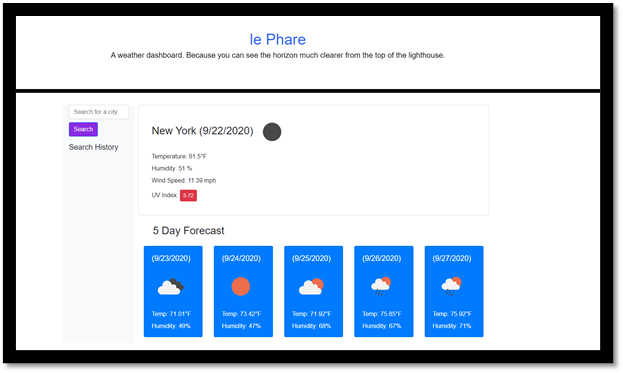

# le-phare-weather-dashboard
A weather dashboard for all those voyageurs de phare.

## Installation

This web app is made up of an Index.html file and a script.js file, which controls the weather dashboard functionality.  There is also a css file for some styling.

The location is: https://christopher-cruzcosa.github.io/le-phare-weather-dashboard/

## Usage 

The user will initially see a weather dashboard populated by New York.  When they search for a city, it will replace New York and a button will be made in the search history section to note that the city was searched for previously.  The weather for each city will display the current attributes of the weather at that city including: temperature, wind speed, humidity, an icon for current conditions, and UV index.  There will also be a five day forecast that will show an icon for current weather, temperature, and humidity.

## Credits

Created by: Christopher Cruzcosa

## License

Copyright (c) [2020] [Christopher Cruzcosa]

Permission is hereby granted, free of charge, to any person obtaining a copy
of this software and associated documentation files (the "Software"), to deal
in the Software without restriction, including without limitation the rights
to use, copy, modify, merge, publish, distribute, sublicense, and/or sell
copies of the Software, and to permit persons to whom the Software is
furnished to do so, subject to the following conditions:

The above copyright notice and this permission notice shall be included in all
copies or substantial portions of the Software.

THE SOFTWARE IS PROVIDED "AS IS", WITHOUT WARRANTY OF ANY KIND, EXPRESS OR
IMPLIED, INCLUDING BUT NOT LIMITED TO THE WARRANTIES OF MERCHANTABILITY,
FITNESS FOR A PARTICULAR PURPOSE AND NONINFRINGEMENT. IN NO EVENT SHALL THE
AUTHORS OR COPYRIGHT HOLDERS BE LIABLE FOR ANY CLAIM, DAMAGES OR OTHER
LIABILITY, WHETHER IN AN ACTION OF CONTRACT, TORT OR OTHERWISE, ARISING FROM,
OUT OF OR IN CONNECTION WITH THE SOFTWARE OR THE USE OR OTHER DEALINGS IN THE
SOFTWARE.

